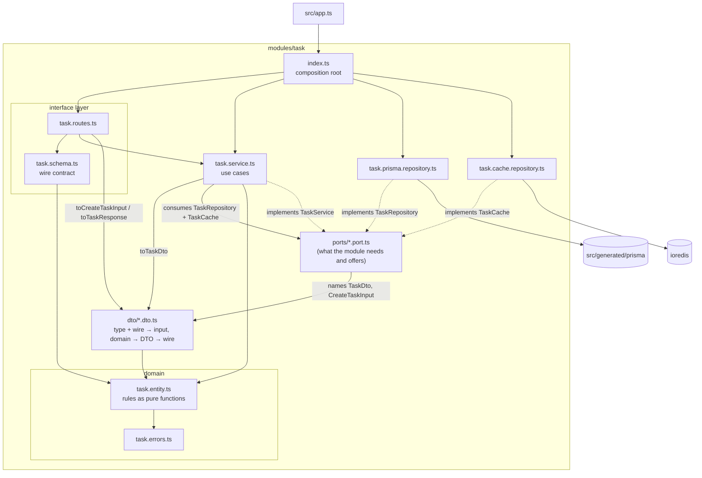

# Architecture

This template applies the load-bearing ideas of **Clean Architecture** — the
dependency rule, ports and adapters, a framework-free core — through
**Fastify's own composition model** (plugins, decorators, encapsulation),
organized as **vertical feature modules** rather than horizontal global layers.

Most rules on this page are enforced by `npm run boundaries`
(dependency-cruiser). The ones that are **not** — and there are two — say so
where they appear: keeping entities out of a published API, and which shape of
data flows where. Treat an unmarked rule as tool-checked and a marked one as
review-checked.

---

## 1. The shape: vertical modules, layered inside

A feature lives in one folder under `src/modules/`. The clean-architecture
layering exists **inside** the module, not as app-wide `domain/`, `adapters/`,
`drivers/` trees:

```
modules/task/
├── index.ts                   composition root
├── ports/                     EVERY dependency the module inverts or publishes
│   ├── repository.port.ts     TaskRepository
│   ├── cache.port.ts          TaskCache
│   ├── service.port.ts        TaskService, TaskServiceDeps
│   └── public-api.port.ts     TaskPublicApi — the ONLY file siblings may import
├── dto/                       EVERY transfer model, one file per model,
│   │                          each holding its type AND its mappings
│   ├── task.dto.ts            CreateTaskInput, TaskDto, toCreateTaskInput,
│   │                          toTaskDto, toTaskResponse
│   └── task-summary.dto.ts    TaskSummaryDto + its mappings
├── task.routes.ts   ┐
├── task.schema.ts   ┘         interface layer (Fastify + Zod)
├── task.service.ts            application layer (implements TaskService)
├── task.prisma.repository.ts  implements TaskRepository (Prisma)
├── task.cache.repository.ts   implements TaskCache (Redis)
├── task.entity.ts   ┐
└── task.errors.ts   ┘         domain (pure TypeScript)
```

A module that calls an external capability adds a third kind of implementation:
`modules/generation/` holds `generation.prisma.repository.ts`,
`generation.cache.repository.ts` and `generation.anthropic.service.ts`. See
"Two families of implementation" below.



### The dependency rule

Dependencies point downward only. Per file-role, matched by filename. Every row
except `*.routes.ts` / `*.schema.ts` / `index.ts` has a dedicated rule in
`.dependency-cruiser.cjs` named after it; those three are constrained instead by
the cross-cutting rules below (`prisma-sdk-is-contained`,
`implementations-composed-only-at-the-root`, `modules-are-islands`). The
per-technology rules — `<tech>-implementation-stays-below` and
`<tech>-sdk-is-contained` — are generated from the `ADAPTERS` table at the top
of that file, one row per technology.

| Layer (file)                     | May import                                                                                  | Must never import                                                            |
| -------------------------------- | ------------------------------------------------------------------------------------------- | ---------------------------------------------------------------------------- |
| `*.entity.ts`, `*.errors.ts`     | each other, `lib/errors`, `lib/clock`, `lib/pagination`                                     | **anything else** — no npm package, no Fastify, no Zod, no Prisma            |
| `dto/*.dto.ts` (transfer models) | domain files, its sibling DTO files, pure lib                                               | **`ports/`**, Zod, Fastify, SDKs, implementations, services, routes, schemas |
| `ports/*.port.ts`                | domain files, its `dto/`, its own port files, other modules' `public-api.port.ts`, pure lib | frameworks, SDKs, implementations, services                                  |
| `<module>.service.ts`            | domain, its `dto/`, its ports, other modules' published API, pure lib, `lib/article-text`   | Fastify, Zod, Prisma, ioredis, implementations, routes, schemas              |
| `*.prisma.repository.ts`         | domain, its ports, `src/generated/prisma`, pure lib                                         | Fastify, **`dto/`**, services, routes, schemas, other implementations        |
| `*.cache.repository.ts`          | domain, its ports, `ioredis`, pure lib                                                      | Fastify, Prisma, services, routes, schemas, other implementations            |
| `*.s3.repository.ts`             | domain, its ports, `@aws-sdk/*`, node builtins, pure lib                                    | Fastify, Prisma, services, routes, schemas, other implementations            |
| `*.anthropic.service.ts`         | domain, its ports, `@anthropic-ai/sdk`, `zod`, pure lib                                     | Fastify, Prisma, services, routes, schemas, other implementations, `lib/`    |
| `*.routes.ts`, `*.schema.ts`     | everything in the module except an implementation; `lib`                                    | Prisma, other modules                                                        |
| `index.ts`                       | everything in its module                                                                    | other modules' internals                                                     |

`<module>.service.ts` (one dot) is the application service;
`<module>.<tech>.service.ts` (two dots) is an outbound adapter, and the rules
tell them apart by that dot alone. Never put a dot in an application service's
stem.

Cross-cutting rules, also enforced:

- **Modules are islands with one door.** A module may import exactly one file
  from another module: its `ports/public-api.port.ts`. Everything else in that
  folder — entity, errors, the other port files, service, implementations — is
  private. Shared _code_ still moves to `lib/`. Because the published API has a
  file of its own, this is enforced: reaching for a sibling's repository port or
  DTO fails `npm run boundaries`. (**Still by hand:** keeping entities _out of_
  `public-api.port.ts` — the rule sees the file, not the shape of the types.)
- **Prisma appears in exactly three places**: `*.prisma.repository.ts`,
  `src/plugins/database.ts` (lifecycle), and the type augmentation.
  Tests are exempt — factories seed through Prisma deliberately.
- **The AWS SDK appears in exactly three places** — same shape:
  `*.s3.repository.ts`, `src/plugins/s3.ts` (lifecycle), the type
  augmentation; tests exempt.
- **ioredis appears in exactly three places** — same shape again:
  `*.cache.repository.ts`, `src/plugins/redis.ts` (lifecycle), the type
  augmentation; tests exempt.
- **`@anthropic-ai/sdk` appears in exactly three places** — same shape again:
  `*.anthropic.service.ts`, `src/plugins/anthropic.ts` (lifecycle), the type
  augmentation; tests exempt.
- **Implementations are instantiated only in a composition root** (`index.ts`),
  and never import each other. Everything else programs against the port.
- `lib/` imports nothing above itself; `plugins/` never import modules.

### The composition roots

`src/app.ts` composes the application: infrastructure plugins first, then
modules with their mount prefixes, in an order you read top to bottom. The
plugins arrive by directory — `@fastify/autoload` over `src/plugins/`, so
dropping a file in registers it — because they are interchangeable: each is
`fastify-plugin`-wrapped, reads only `app.config`, and decorates the instance.
Autoload's order is alphabetical unless a plugin names what it needs in its
`dependencies` metadata, which hoists it (see `plugins/swagger.ts`); an
ordering requirement lives in the plugin that has it, not in this file. Modules
stay listed by hand: their order is load-bearing and their prefixes belong in
the composition root. Each
module's `index.ts` composes the module: implementations → service → routes.
These are the only places that know which concrete implementation is used —
swapping PostgreSQL for something else is a new
`<module>.<technology>.repository.ts` plus one changed line in `index.ts`.

### Publishers and consumers (cross-module use)

Capabilities flow between modules as **runtime values on the Fastify instance**,
typed by a **public API the providing module publishes in its own
`ports/public-api.port.ts`**:

- A **publisher** module (`modules/user`, `modules/task`) declares a
  `*PublicApi` type — pure data over ids and plain inputs, naming only the
  capabilities it offers — and decorates the instance with its service
  (`fastify.decorate("userService", service)`). The full service satisfies the
  narrower type structurally, so the decoration compiles unchanged.
  Publishing changes the module's shape: it is wrapped in `fastify-plugin` so
  the decoration escapes encapsulation, and it therefore mounts its own route
  prefix internally.
- `src/types/fastify.d.ts` types each decoration as **the published API, not
  the service**. That is what makes the boundary real rather than advisory:
  `fastify.userService.setAvatar(...)` from an unrelated module is a compile
  error (`Property 'setAvatar' does not exist on type 'UserPublicApi'`), not a
  violation that no tool can see.
- A **consumer** module (`modules/onboarding`) imports those types directly
  from the publishers' `ports/public-api.port.ts` and wires `fastify.userService`
  into its service in `index.ts`. The import is a real edge, so dependency-cruiser
  polices it — and because that file holds nothing but the published API, the rule
  now checks _which type_ crosses, not just which file;
  `find all references` on a published type finds every consumer.
- `app.ts` registers publishers before consumers; entities never cross the
  boundary — the published API only admits ids and plain inputs.

**`ports/` carries two jobs**, kept apart by filename — the outbound port files
(`repository.port.ts`, `cache.port.ts`, `lock.port.ts`, …) plus the module's own
`service.port.ts`, and then `public-api.port.ts` on its own:

|                  | The port files                                                 | `public-api.port.ts`                    |
| ---------------- | -------------------------------------------------------------- | --------------------------------------- |
| Direction        | what the module **needs**                                      | what the module **offers**              |
| Purpose          | invert an outbound infrastructure dependency (S3, cache, mail) | publish a capability to sibling modules |
| Implementations  | several, deliberately (real, in-memory, …)                     | one, forever                            |
| Admits           | the module's own entities                                      | **ids and plain data only**             |
| Crosses a border | never — `modules-are-islands` fails the build                  | the only file that may                  |

That last row is the point of the split (ADR-0010). While every abstract type
shared one file, `modules-are-islands` could police which file crossed a border
but not which type inside it, so a sibling could take a repository port and no
tool would notice. With the published API alone in `public-api.port.ts`, the rule
checks both. **Still by hand:** keeping entities out of that file — the rule sees
the path, not the types.

A capability another module owns still belongs in the public API section, never
in the ports section: never re-declare a sibling's signature as a port of your
own.

`modules/onboarding` is the live reference: one user action that spans three
modules (mark user onboarded → create welcome task), importing two published
API types and nothing else, unit-tested with five-line fakes of them.

### Outbound infrastructure: plugin → port → implementation

External systems (object storage, cache, mail, payments) always split into the
same three pieces — the live reference is the avatar upload in `modules/user`:

| Piece              | File                                 | Owns                                                                                                                    |
| ------------------ | ------------------------------------ | ----------------------------------------------------------------------------------------------------------------------- |
| **Plugin**         | `src/plugins/s3.ts`                  | The raw client's lifecycle only: create from config, `decorate("s3")`, destroy on close. No buckets, no logic.          |
| **Port**           | `modules/user/ports/avatar.port.ts`  | _What_ the module needs, in its own vocabulary: `AvatarRepository.uploadAvatar(...)`. No SDK words.                     |
| **Implementation** | `modules/user/user.s3.repository.ts` | _How_ that maps to the technology: bucket, key layout, `PutObjectCommand`. The only module file importing `@aws-sdk/*`. |

**Two families of implementation.** A port implementation is named
`<module>.<technology>.repository.ts` when it adapts something the module
**stores into and reads back** — Prisma, Redis, the filesystem, S3 — and
`<module>.<technology>.service.ts` when it adapts an **external capability the
module calls and gets an answer from**: `generation.anthropic.service.ts` sends
an article to a model and receives a quiz, storing nothing and fetching nothing
by id. Both keep the technology in the middle so the composition root shows it
being chosen, and both are bound by
`implementations-composed-only-at-the-root`. `index.ts` introduces them
(`createS3AvatarRepository(fastify.s3, config.S3_AVATARS_BUCKET)`), the service
consumes only the port, and unit tests substitute an in-memory
`AvatarRepository` (`test/helpers/in-memory-avatar-repository.ts`).

**An adapter holds no policy** (ADR-0009, ADR-0012). `generation.anthropic.service.ts`
is one model turn plus a correction turn, with the vendor's errors and stop
reasons translated into named module errors. Everything a second vendor would
need identically — extracting the article's text, planning the question range,
validating the candidate, deciding whether to spend a correction turn — is the
use case's and lives in `generation.service.ts`, where the unit lane covers it
with `test/helpers/stub-quiz-generator.ts`. The port returns a
`GenerationAttempt` whose `correct(reasons)` yields the next attempt; the SDK's
message content stays inside that closure. An adapter cannot be split into
helper files — an implementation may not import a sibling or a helper, and a
helper may not import the SDK — so the only way to shrink one is to move
non-technology work up.

**Caching is exactly the same three pieces** — the live reference is
`modules/task`. `src/plugins/redis.ts` owns the client, `ports/cache.port.ts`
declares `TaskCache` in the module's vocabulary (`read` / `write` / `forget`,
never `get`/`set`/`expire`), and `task.cache.repository.ts` owns the key
layout, the TTL and the JSON codec.

**The cache is a sibling of the repository, not a wrapper around it.** There is
no middle file: `task.cache.repository.ts` talks to Redis and nothing else, and
`task.service.ts` holds both ports and decides, use case by use case, which one
to read. Turning caching off is swapping the implementation in `index.ts` for a
no-op one. What the service must keep right:

- **Queries may be cached; commands may not.** `getTask` reads the cache first
  and falls back to the repository; `completeTask` and `archiveTask` read the
  repository directly. A read-modify-write that starts from a cached entity is
  not a staleness trade-off, it is a correctness bug: the domain rules get
  evaluated against a state that no longer exists, and `save` then writes the
  whole stale entity back over fields it never saw change. Note that busting on
  write does **not** prevent this — a reader that missed can fill the cache
  _after_ a concurrent `save` has already cleared it, so a stale entry can
  outlive its own invalidation by a full TTL. This is the line every module
  copying `modules/task` has to keep, and `test/unit/task.service.test.ts`
  holds it.
- **Invalidation lives on the write path.** Every save goes through one
  `persist()` helper that calls `cache.forget`, so the classic failure — a
  write that invalidates nothing — has one place to be got right instead of
  one per use case.
- **The service imports no SDK**, so the unit lane covers the whole caching
  policy with two in-memory port implementations and no container.
- **Lists are deliberately uncached.** Cursor-paginated, filtered results make
  invalidation combinatorial for a poor hit rate. Cache entities by id.

Two failure policies are decided in the implementation, not the port:

- **A cache outage degrades to the source of truth.** `read` returns null,
  `write` and `forget` are best effort — `task.cache.repository.ts` catches, the
  service does not. A cache that can fail requests is a new single point of
  failure, which is the opposite of the point.
- **The TTL is the bound on a lost invalidation.** `forget` cannot be
  guaranteed without an outbox, so `CACHE_TTL_SECONDS` is how stale the data
  can get in the worst case. That is a deliberate ceiling, not an oversight.
- **The key carries a version** (`task:v1:`). A cached blob outlives a deploy;
  bump the version whenever the entity's shape changes and the old keys expire
  unread. A blob that no longer parses is treated as a miss, never a 500.

Two rules keep this honest:

- **Purpose in the port, technology in the implementation.** A port method
  named `uploadToAvatarsBucket` has already leaked S3 into the domain even with
  clean imports; the port says `uploadAvatar`, the implementation knows about
  buckets. The `user.s3.repository.ts` filename carries the tech instead.
- **No dead SDKs.** The integration lane runs the real implementation against
  MinIO (S3-compatible, started by Testcontainers in `test/int/setup/minio.ts`),
  so the S3 path is exercised on every run with no AWS account — the same
  standard as the database.

---

## 2. The four shapes of data

One kind of object per boundary. TypeScript's structural typing does the
conversion work cheaply, but the _types_ stay separate because the boundaries
change for different reasons.

| #   | Kind            | Lives in                                  | Built with                    | Purpose                                                                                        |
| --- | --------------- | ----------------------------------------- | ----------------------------- | ---------------------------------------------------------------------------------------------- |
| 1   | **Wire shape**  | `*.schema.ts`                             | Zod                           | The public HTTP contract: what is validated in and serialized out, and what OpenAPI documents. |
| 2   | **DTO**         | `dto/<model>.dto.ts` (type + its mappers) | plain `type` + mappers        | What a service takes and returns: the transfer models that cross interface ↔ application.      |
| 3   | **Domain type** | `*.entity.ts`                             | plain `type` + pure functions | The business object and its rules. The vocabulary _inside_ a use case.                         |
| 4   | **Row**         | Prisma generated client                   | `schema.prisma`               | The shape of a database row. A persistence detail.                                             |

Hard rules:

- A **request model never reaches a service.** The route maps it first:
  `toCreateTaskInput(request.body)` and `toListTasksInput(request.query)` in
  `dto/task.dto.ts` turn the Zod-inferred shape into the service's own declared
  input (`CreateTaskInput`, `ListTasksInput`, declared in that same file
  beside the `TaskDto` they are the other half of). A handler never constructs a service
  input inline either — `toSetAvatarInput(id, body, contentType)` assembles the
  one that comes from three parts of the request. Only a bare scalar crosses
  unmapped: `service.getTask(request.params.id)` has no model to convert.
- A **service never returns an entity.** Every use case ends in `toTaskDto()`,
  so a `Task` never reaches a route and the domain can be reshaped without
  touching the API. Unlike the input rule above, this one _is_ checked: the
  service's declared return type is `TaskDto`.
- A **service never returns a wire shape either.** `toTaskResponse()` — the
  same `dto/task.dto.ts`, one hop later — is the one place a DTO becomes JSON
  (dates → ISO strings), and the route is its only caller. The DTO carries
  `Date`s on purpose: serialization is the wire's business, and a sibling
  module reading a published capability should not have to parse dates back.
- A **row never leaves the file that read it.** `toTask()` maps it inside
  `task.prisma.repository.ts`; `select`/`where`/query mechanics are decided
  there, not in the service. The cache implementation owes the same debt in the
  other direction — `task.cache.repository.ts` revives JSON strings back into
  `Date`s before a `Task` leaves it.

A `dto/*.dto.ts` file is plain TypeScript — no Zod, no Fastify
(`dto-stays-pure`) — which is what lets a framework-free service import it. It
may not import `ports/` either: the dependency runs the other way, since
`service.port.ts` names its inputs and outputs from here. So neither mapper names
a Zod-inferred type: each declares the wire shape it accepts or produces as a
plain structural type, and the route is where the two meet. `toTaskResponse()`
is checked against the `response` schema; `toCreateTaskInput()` is checked
against `request.body`. Change a schema without changing its mapper and the
route stops compiling — which is why neither direction needs a rule of its own
in `.dependency-cruiser.cjs`.

### One request, end to end

`POST /api/tasks/:id/complete`:

```
HTTP request
  → taskParamsSchema            (Zod: well-formed id?)
  → service.completeTask(id)    (application: orchestrate)
      → repository.findById     (port — NEVER cache.read: this is a command)
          → prisma repository   → SELECT → row → toTask() → Task
      → completeTask(task)      (domain: archived? already done?)
      → repository.save         (port) → UPDATE
      → cache.forget(id)        (port — invalidate on the write path)
      → toTaskDto(task)         (the entity stops here)
  → toTaskResponse(dto)         (wire: Dates → ISO strings)
HTTP 200 — or 404/409 mapped from the domain error by the error-handler plugin
```

That path carries only an id, so nothing is mapped on the way in. `POST
/api/tasks` shows the other half:

```
HTTP request
  → createTaskBodySchema            (Zod: valid title? coercible dueDate?)
  → toCreateTaskInput(request.body) (wire → CreateTaskInput; undefined → null)
  → service.createTask(input)       (application: the Zod type stops here)
      → draftTask(input, now)       (domain: due date in the past?)
      → repository.create           (port) → INSERT
      → toTaskDto(task)             (the entity stops here)
  → toTaskResponse(dto)             (wire: Dates → ISO strings)
HTTP 201
```

The query twin, `GET /api/tasks/:id`, is the one that reads the cache:
`cache.read(id)` first, `repository.findById` on a miss, `cache.write(task)` on
the way back. Which of the two shapes a use case follows is the whole of the
caching policy — see §1.

---

## 3. Errors

Errors are raised in domain vocabulary and translated to HTTP in exactly one
place.

| Where                          | What                                                                                                                                                                                              | Example                                   |
| ------------------------------ | ------------------------------------------------------------------------------------------------------------------------------------------------------------------------------------------------- | ----------------------------------------- |
| `src/lib/errors.ts`            | The vocabulary: `AppError` base with a `code` union (`NOT_FOUND`, `CONFLICT`, `UNPROCESSABLE`, `UNAUTHORIZED`, `FORBIDDEN`). No status codes.                                                     | —                                         |
| `modules/*/​*.errors.ts`       | Named errors subclassing the vocabulary, message baked in at the definition.                                                                                                                      | `TaskArchivedError extends ConflictError` |
| `src/plugins/error-handler.ts` | The **only** place status codes exist: `code → status` table, plus validation errors (400), Fastify plugin errors (e.g. 429), and the unknown-error 500 that logs everything and reveals nothing. | —                                         |

Every failing response has the same body: `{ "message": "..." }`.

Rules of thumb:

- A library exception must not escape the implementation that caused it —
  translate it (see `save()` in `task.prisma.repository.ts` catching Prisma's
  P2025 → `TaskNotFoundError`).
- Services and entities `throw new SomethingError()` — they never see a status
  code and never format a response.
- Messages live with the error class that owns them, not in a global catalog;
  the `code` union is the hook if per-locale mapping is ever needed at the
  edge.

---

## 4. Tests

| Suite                | Location                                      | Runs against                                         | Needs   |
| -------------------- | --------------------------------------------- | ---------------------------------------------------- | ------- |
| Domain               | `test/unit/task.entity.test.ts`               | entity functions directly                            | nothing |
| Use cases + caching  | `test/unit/task.service.test.ts`              | in-memory repository + in-memory cache + fixed clock | nothing |
| DB implementation    | `test/int/task.prisma.repository.test.ts`     | real PostgreSQL                                      | Docker  |
| Cache implementation | `test/int/task.cache.repository.test.ts`      | real Redis                                           | Docker  |
| S3 implementation    | `test/int/user.s3.repository.test.ts`         | real S3 API (MinIO)                                  | Docker  |
| HTTP                 | `test/int/task.routes.test.ts`, `app.test.ts` | the real app via `inject()` + real PostgreSQL        | Docker  |
| Cross-module wiring  | `test/int/onboarding.test.ts`                 | two publisher modules through their decorations      | Docker  |

The caching policy has no test file of its own, because it has no file of its
own: it lives in the use cases, so it is tested with them. That is also the only
thing standing where a type used to — see ADR-0007.

Two design points carry the strategy:

1. **The in-memory implementations are genuine implementations of the ports,
   not mocks** (`test/helpers/in-memory-task-repository.ts`,
   `in-memory-task-cache.ts`). Each honors the same contract its real twin
   honors (ordering, cursor semantics; miss-is-null, write-replaces,
   forget-removes), and the integration tests verify that contract against the
   real database and the real Redis. Unit tests therefore exercise real code
   paths — there is no mocking framework in this template at all.
2. **Config is a value**, so `buildTestApp({ DOCS_PASSWORD: "secret" })` can
   exercise config-dependent behavior without touching `process.env`.

The integration lane (`test/int/setup/`) boots one throwaway Postgres, one
MinIO and one Redis per run via Testcontainers, applies the migration SQL once
to a template database, clones one database per Vitest worker, and TRUNCATEs
between tests (workers share the MinIO bucket safely — avatar keys are unique
per upload — and each takes its own Redis logical database, FLUSHDB'd between
tests).
Write integration tests accordingly:

- **Arrange with factories** (`test/int/factories/`), never with other tests.
- **Never hardcode ids** — TRUNCATE restarts sequences; read ids off the row
  the factory returns.
- **A journey lives in one `it`** — the truncate runs between cases.

---

## 5. What this template deliberately does NOT do

Recorded so they are choices, not accidents. The long version of each is an
ADR in [docs/adr/](docs/adr/).

- **No DI container** (ADR-0002). Explicit wiring in two small composition
  roots replaces Awilix: the object graph is compiler-checked, "find all
  references" works, and no generator is needed to keep wiring safe.
- **No consumer-owned ports for peer modules** (ADR-0006). A capability another
  module owns is published by that module as a `*PublicApi` type in its
  `ports/public-api.port.ts` and imported directly; re-declaring its signature
  per consumer costs duplication and buys a rule no tool can enforce.
- **No global horizontal layers** (ADR-0001). `use_cases/`-style top-level
  trees scale by layer; modules scale by feature. Deleting a feature is
  deleting a folder.
- **No entity classes** (ADR-0003). Domain = types + pure functions, not
  objects with methods.
- **No DTO per layer** (ADR-0008, ADR-0011). One `dto/<model>.dto.ts` owns
  that model's whole edge in both directions — the service's declared input and
  its `<Name>Dto` return type, with the three mappings between them. There is no
  third model per layer, a row is still mapped inside the file that read it, and
  the service ↔ repository hop needs no transfer model at all: a port is written
  in the module's own domain vocabulary, so an entity crosses it unmapped.
- **No dead code — infrastructure is either exercised or absent.** The S3
  integration ships because every line of it runs against MinIO in the
  integration lane; auth, transactions and typed JSON columns remain
  documented patterns in [docs/recipes.md](docs/recipes.md) until a project
  needs them. Never keep an SDK that no test exercises.
- **No shared integration services in `lib/`** (ADR-0009). `lib/` holds
  stateless SDK mechanics importable only by port implementations; a
  third-party integration that owns behavior or state — retry, dedup, queues,
  suppression — is a capability module publishing a `*PublicApi`, like any
  other. The tests: does it hold policy or state, could it need another
  module's data, could it grow a webhook route or a table? Any "yes" means a
  module.
- **No pagination-free lists.** Every list endpoint is cursor-paginated from
  day one (`lib/pagination.ts`).
- **No unit-of-work abstraction.** Each repository method is atomic; when one
  use case must commit across repositories, add a transactional port then
  (recipe included) rather than passing ORM sessions around now.
- **No port wrapping another port** (ADR-0007). There is no caching decorator
  and no `*.repository.cached.ts`: implementations are siblings, and the service
  holds both ports so the cache policy is visible in the use case that owns it.
  The cost — a use case can now read the cache in a command by mistake — is paid
  for with a test, not a type.
- **No single `*.ports.ts` per module** (ADR-0010, superseding ADR-0007). Every
  abstract type lives under `ports/`, one `*.port.ts` per role, so
  `modules-are-islands` can enforce that only `public-api.port.ts` crosses a
  border rather than trusting a convention. The price is that "where is this
  declared" costs one guess about role instead of none.
- **No third suffix for external-service adapters** (ADR-0010). An adapter that
  calls a third-party capability is `<module>.<tech>.service.ts`, not a
  `*.gateway.ts` or `*.client.ts` family of its own; the one-dot/two-dot
  distinction against `<module>.service.ts` is the price of reusing the word.
- **No policy in an adapter** (ADR-0009, ADR-0012). A `*.<tech>.service.ts`
  is one vendor call plus error translation; input preparation, planning,
  validation and the retry or correction budget belong to the application
  service, where in-memory ports can test them. The price is a port that
  returns an attempt you can ask to correct, rather than a finished answer.
- **No barrel in `ports/`.** A `ports/index.ts` re-export would restore the
  single import path and destroy the rule the split was made for. `dto/` has no
  barrel either.
- **No transfer model under `ports/`** (ADR-0011). A file under `ports/` names
  something the module needs from outside or offers to siblings; a DTO does
  neither. It lives in `dto/`, and `ports/` depends on it — not the reverse.

---

## 6. Adding a feature

Work inside-out; the boundaries hold you to it (`npm run check`).

1. **Domain** — `<name>.entity.ts` + `<name>.errors.ts`: types, rules, named
   errors. Unit-test them directly.
2. **DTO** — `<name>/dto/<model>.dto.ts`, one file per transfer model: the
   `<Name>Dto` type, the input type the use case accepts, and `toXDto()`
   (domain → DTO). Plain TypeScript — it imports the entity and nothing else in
   the module; this is where you decide what leaves the module at all. The wire
   mappers join it in step 6.
3. **Ports** — `<name>/ports/`, one `*.port.ts` per role: the outbound ports
   (`repository.port.ts`, `cache.port.ts`, and one file per further dependency,
   named for what it inverts — the narrowest interface the use cases need, in
   domain vocabulary), `service.port.ts` for the `<Name>Service` interface and
   its `Deps`, written over the types from step 2, and — if the feature offers
   something to other modules — `public-api.port.ts` holding `<Name>PublicApi`
   over ids and plain inputs (type the decoration with it in
   `src/types/fastify.d.ts`). The published API gets its own file because that is
   what lets `modules-are-islands` enforce the border rather than merely
   document it.
4. **Service** — `<name>.service.ts`: use cases against the ports + clock,
   each ending in `toXDto()`. Unit-test with in-memory port implementations.
5. **Schema** — `schema.prisma` model + `npm run prisma:migrate:create`
   (review the SQL) + `apply`; then the implementation
   `<name>.prisma.repository.ts` with its `toX()` mapper, and an integration
   test for the contract. A port implementation is named
   `<module>.<technology>.repository.ts` when it adapts a store and
   `<module>.<technology>.service.ts` when it adapts an external capability the
   module calls; either way its port type, factory and dependency key say the
   same thing the filename does (`AvatarRepository`, `createS3AvatarRepository`,
   `avatars`).
6. **Interface** — `<name>.schema.ts` (wire shapes), `toXInput()` and
   `toXResponse()` added to each `dto/<model>.dto.ts` (wire → input, DTO →
   wire), and
   `<name>.routes.ts` (schemas on routes, thin inline handlers that map both
   ways and do nothing else).
7. **Compose** — `index.ts` wires implementations → service → routes; register
   the module with its prefix in `src/app.ts`.
8. `npm run check && npm run test:int`. The second is not optional once a
   `ports/*.port.ts` or a `*.<tech>.repository.ts` is involved — the unit lane
   never touches the real implementation.

The `task` module is the reference implementation of all eight steps; `user` adds
a second port with a second technology, and `onboarding` shows a module with no
infrastructure at all.
